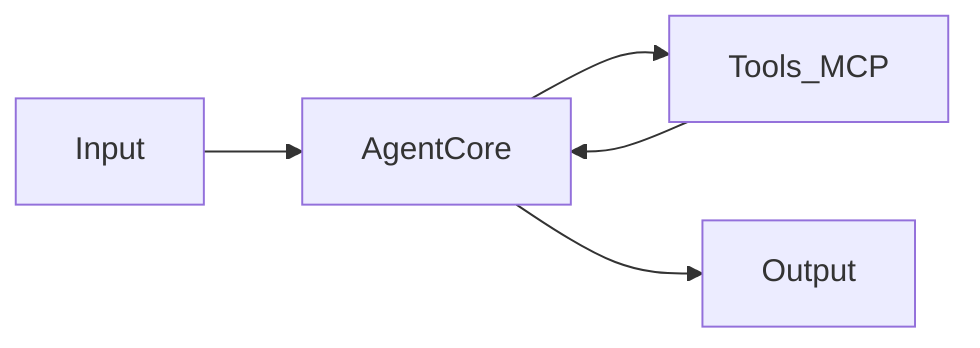

# Architecture

> Trạng thái: **Draft / TBD** — chưa implement runtime.

## Tổng quan

Sprout Champion Agent là hệ thống agent hỗ trợ các tác vụ liên quan đến game Sprout Champion. Kiến trúc dự kiến theo mô hình input → xử lý → output, có thể gọi tools hoặc MCP servers khi cần.

## Thành phần dự kiến

| Thành phần | Vị trí | Mô tả |
|------------|--------|-------|
| Prompts | `prompts/` | System prompt, few-shot examples, template |
| Config | `config/` | Cấu hình model, tool endpoints, feature flags |
| Runtime | `src/` | Orchestration, API handlers, tool adapters |
| Skills | `skills/` | Cursor Agent Skills (tùy chọn) |

## Luồng xử lý (khái niệm)

1. **Input** — nhận yêu cầu từ user, API, hoặc trigger tự động.
2. **Agent core** — load prompt từ `prompts/`, đọc config từ `config/`, gọi LLM.
3. **Tools / MCP** — agent có thể gọi tool bên ngoài (API, database, file system, v.v.).
4. **Output** — trả kết quả dạng text, structured data, hoặc action.

## Chưa quyết định (TBD)

- Orchestration framework (LangChain, Cursor SDK, custom, v.v.)
- Ngôn ngữ runtime (TypeScript, Python, Go, ...)
- Deployment model (local, serverless, container)
- Danh sách tools / MCP servers cụ thể

## Cập nhật tài liệu

Khi chọn stack hoặc thay đổi kiến trúc, cập nhật file này và thêm ADR tương ứng trong `docs/decisions/`.
